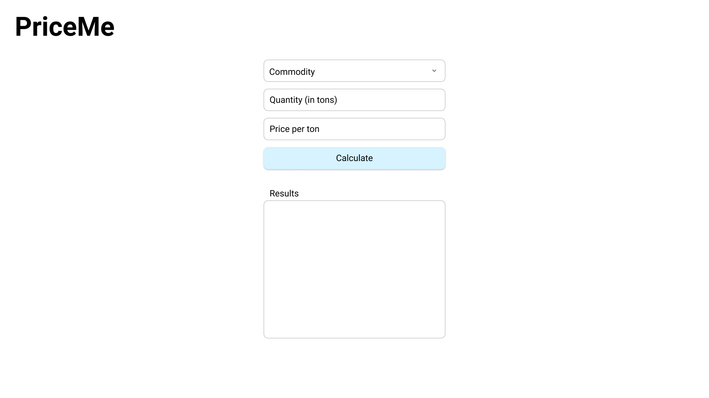

# PriceMe Full Stack Follow Up

Now that you've put together the meat of how PriceMe works, lets extend your challenge with a couple key pieces of the stack:

1. a front end / UI
2. a consumable and extensible API

<i>**Note:** We provided a `start:server` script for you as a template using `babel-node`, which is configured to be able to execute `.ts` script files. However, feel free to change it if you have something else in mind.</i>

## Front End

This repo was bootstrapped using CRA (create-react-app), so everything is set up for you as far as the front end web server goes, so all you need to do is run `npm start` and a web server on port 3000 of `localhost` will be available for you to connect to in the browser. CRA has HMR (hot module reloading) already baked in, so any changes you make in `App.tsx` (and any subsequent modules you decide to create) will automatically get picked up as long as the web server is running.

### Design

We want you to take the provided wireframe and stand up a single page application that mirrors the design **structurally**, but feel free to take creative liberty with the aesthetics and the "look and feel" of the page.

### API

We want you to stand up a simple API server (don't worry about CORS or HTTPS/SSL) with various endpoints that a client can hit and consume the response. In our case, your API should be able to serve the necessary data given the request from the front end / UI, which should be very similar to the request that you provided in your initial challenge via the CLI.

### Addendum

A few pieces of advice:

1. We are not expecting you to complete this challenge end-to-end in 1 hour, although if you can that is definitely a plus.
2. We are not expecting you to be a design/UI/UX guru, so don't worry about the aesthetics of the application, just make sure you follow the general structure given.
3. Don't worry about using Typescript if you are not familiar with it, we just use Typescript in our stack so we set it up this way, but feel free to omit any Typescript syntaxes as should still work regardless (we'll help you debug through issues if you come up with any Typescript related ones should you opt out of using Typescript).

And just in general, have fun with this challenge and feel free to ask as many questions as you need. We won't dock you any "points" for asking "too many questions".
